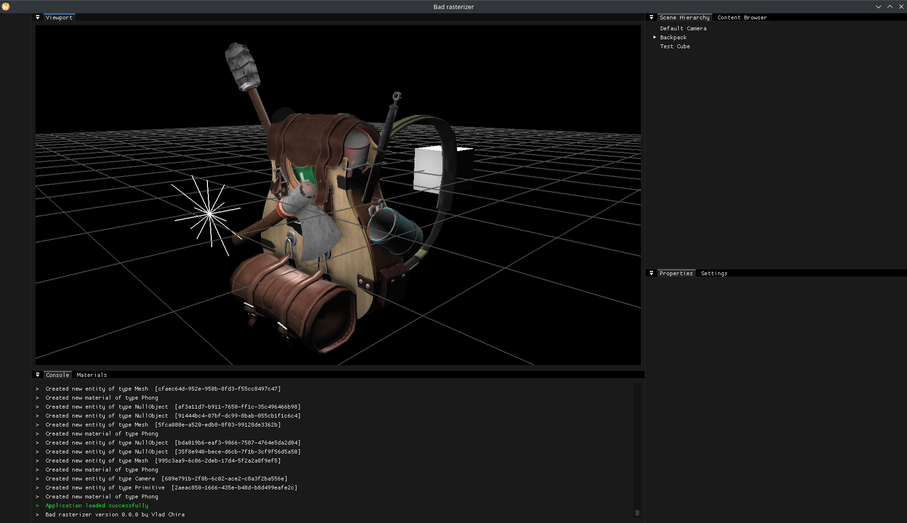
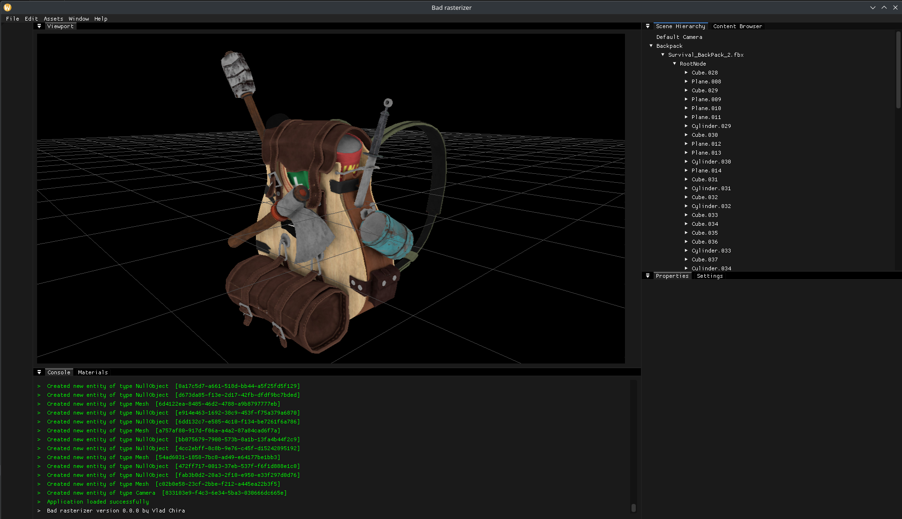

# Stuff I make while learning to write a PBR rasterizer in OpenGL

Current interface with a backpack model, a simple cube and a point light

## Roadmap:
- ~~Basic OpenGl stuff: VAOs, VBOs, shaders, textures~~
- ~~Phong materials~~
- ~~Basic lighting: ambient lights, directional lights, point lights, spot lights~~
- ~~3D Model loading~~
- ~~Basic ImGUI UI: viewport~~
- ~~Entity hierarchy~~
- Primitives: cubes, spheres, triangles, cylinders
- Good ImGUI UI: entities property panel, import models, add lights, multiple cameras
- 3D move/rotate/scale gizmos
- Anti-aliasing
- Face culling, depth testing
- Better GLSL
- Shadows
- Normal maps
- HDR
- Ambient Occlusion
- PBR workflow!
- HDRI lighting
- Node graph-based material system
- Great ImGUI UI: Asset Manager, Icons, Render Settings Panel, Image Export
- Ray tracing?
- Compute shaders?

Dependencies (so far):
- OpenGL w/ GLEW & GLFW
- Dear ImGUI - docking branch
- stb_image.h
- Assimp library

## Previous versions

v0.0.1 interface with a backpack model and no lighting
