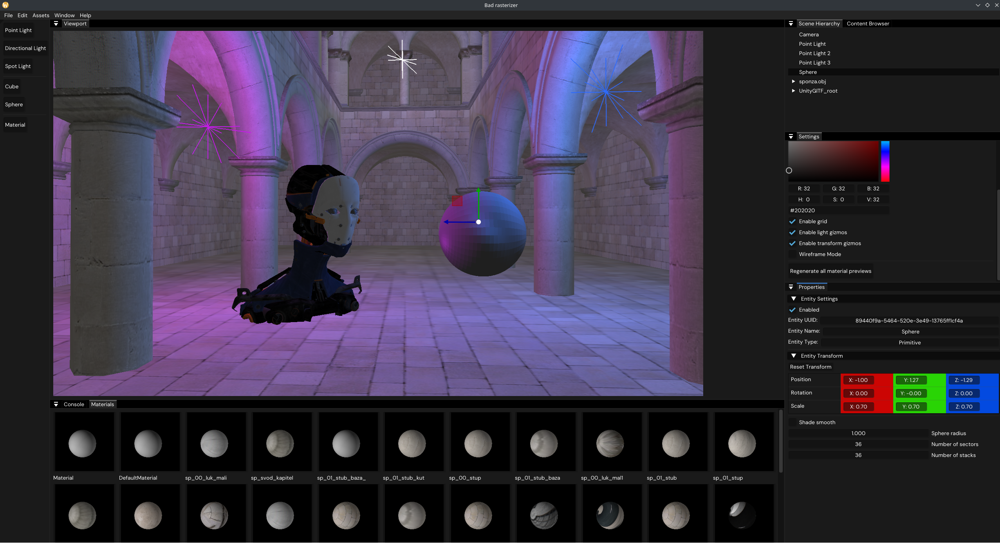
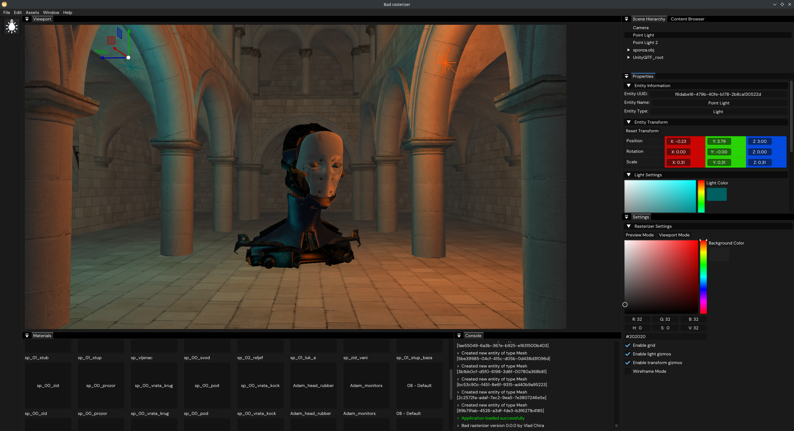
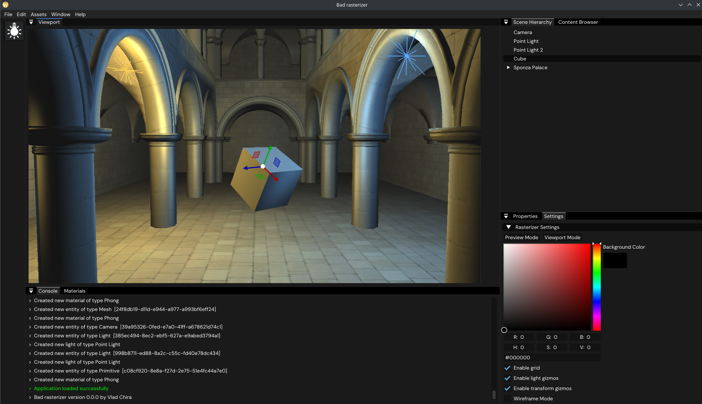
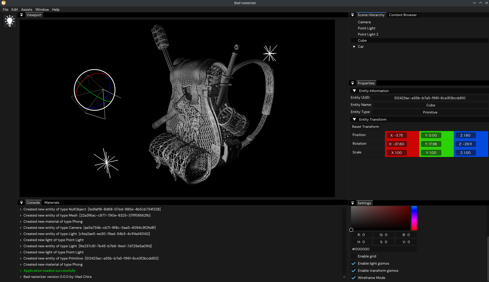
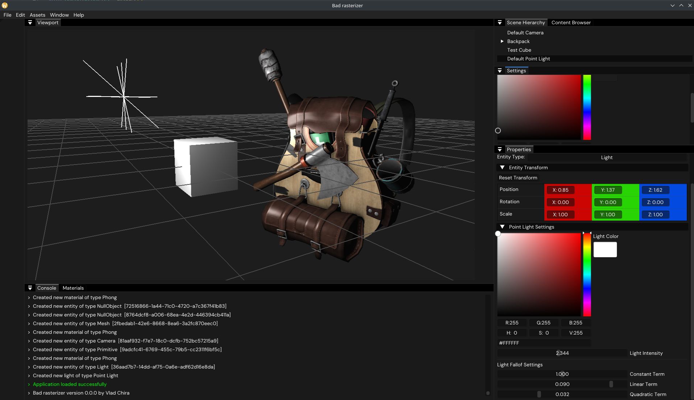
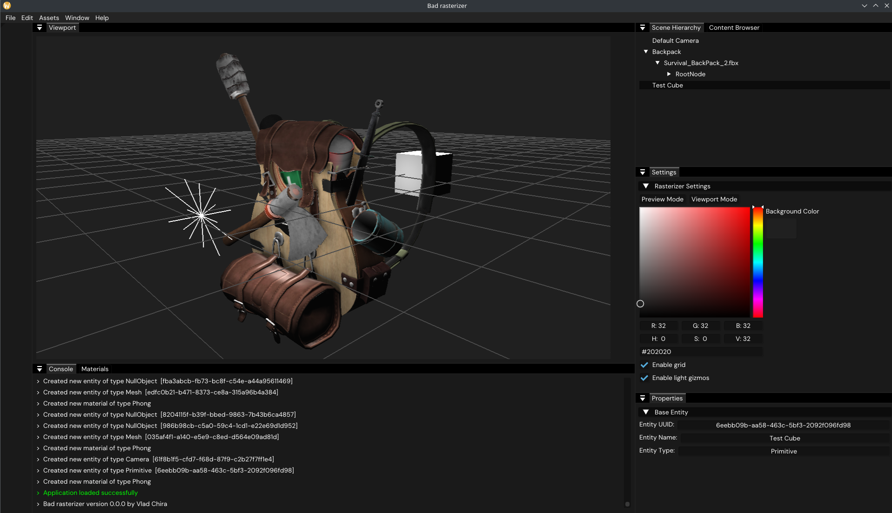

# Stuff I make while learning to write a PBR rasterizer in OpenGL

Dabrovic Sponza scene with the Adam Head, 2 point lights and a flat shaded sphere

## Roadmap:
- ~~Basic OpenGl stuff: VAOs, VBOs, shaders, textures~~
- ~~Phong materials~~
- ~~Basic lighting: ambient lights, directional lights, point lights, spot lights~~
- ~~3D Model loading~~
- ~~Basic ImGUI UI: viewport~~
- ~~Entity hierarchy~~
- Primitives: ~~cubes~~, ~~spheres~~, cylinders, pyramids
- Good ImGUI UI: ~~entities property panel~~, import models, add lights, multiple cameras, ~~material manager and editor~~
- ~~Material preview on sphere~~
- ~~3D move/rotate/scale gizmos~~
- ~~Enable/Disable object (Visibility)~~
- Anti-aliasing
- Selected object outline with stencil buffer
- ~~Face culling, depth testing~~
- Better GLSL
- Deferred shading
- Shadows
- Normal maps
- HDR
- Ambient Occlusion
- PBR workflow!
- HDRI lighting
- Node graph-based material system
- Great ImGUI UI: Asset Manager, Icons, Render Settings Panel, Image Export
- Ray tracing?
- Compute shaders?

Dependencies (so far):
- OpenGL w/ GLAD & GLFW
- Dear ImGUI - docking branch
- ImGuizmo
- stb_image.h
- Assimp library

## Previous versions

v0.0.7 with Dabrovic Sponza Palace, the Adam Head and 2 point lights

v0.0.6 with Dabrovic Sponza Palace, a simple cube and 2 point lights

v0.0.5 with a backpack model, a simple cube and 2 point lights, wireframed

v0.0.4 with a backpack model, a simple cube and a point light

v0.0.3 with a backpack model, a simple cube and a point light

v0.0.2 with a backpack model, a simple cube and a point light

v0.0.1 interface with a backpack model and no lighting
